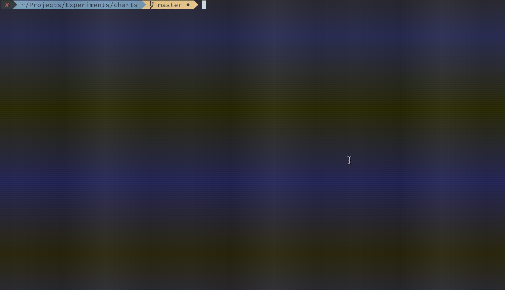

# Helm chart library for Kubernetes

Applications ready to launch on Kubernetes using [Kubernetes Helm](https://github.com/helm/helm).



## Before you begin

### Setup a Kubernetes Cluster

The quickest way to setup a Kubernetes cluster is with [Azure Kubernetes Service](https://azure.microsoft.com/en-us/services/kubernetes-service/), [AWS Elastic Kubernetes Service](https://aws.amazon.com/eks/) or [Google Kubernetes Engine](https://cloud.google.com/kubernetes-engine/) using their respective quick-start guides. For setting up Kubernetes on other cloud platforms or bare-metal servers refer to the Kubernetes [getting started guide](http://kubernetes.io/docs/getting-started-guides/). You can also setup it to run locally using [minikube](https://github.com/kubernetes/minikube/).

### Install Helm

Helm is a tool for managing Kubernetes charts. Charts are packages of pre-configured Kubernetes resources.

To install Helm, refer to the [Helm install guide](https://github.com/helm/helm#install) and ensure that the `helm` binary is in the `PATH` of your shell.

### Add Repo

The following command allows you to download and install all the charts from this repository:

```bash
$ helm repo add titenkov https://titenkov.com/charts
```

### Using Helm

Once you have installed the Helm, you can deploy a Helm Chart into a Kubernetes cluster.

Please refer to the [Quick Start guide](https://github.com/helm/helm/blob/master/docs/quickstart.md) if you wish to get running in just a few commands, otherwise the [Using Helm Guide](https://github.com/helm/helm/blob/master/docs/using_helm.md) provides detailed instructions on how to use the Helm client to manage packages on your Kubernetes cluster.

Useful Helm Client Commands:
* View available charts: `helm search repo`
* Install a chart: `helm install my-release titenkov/<package-name>`
* Upgrade your application: `helm upgrade`

